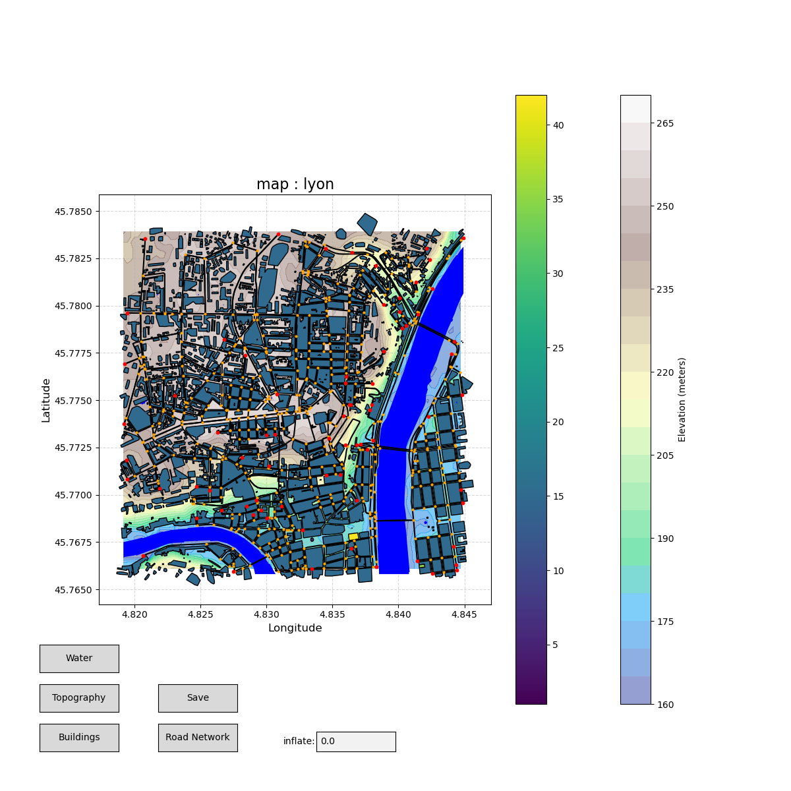
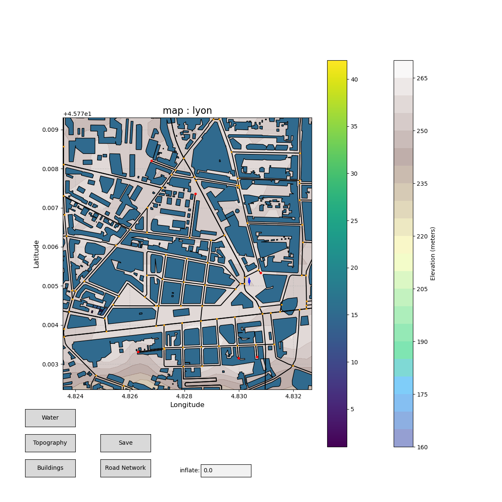
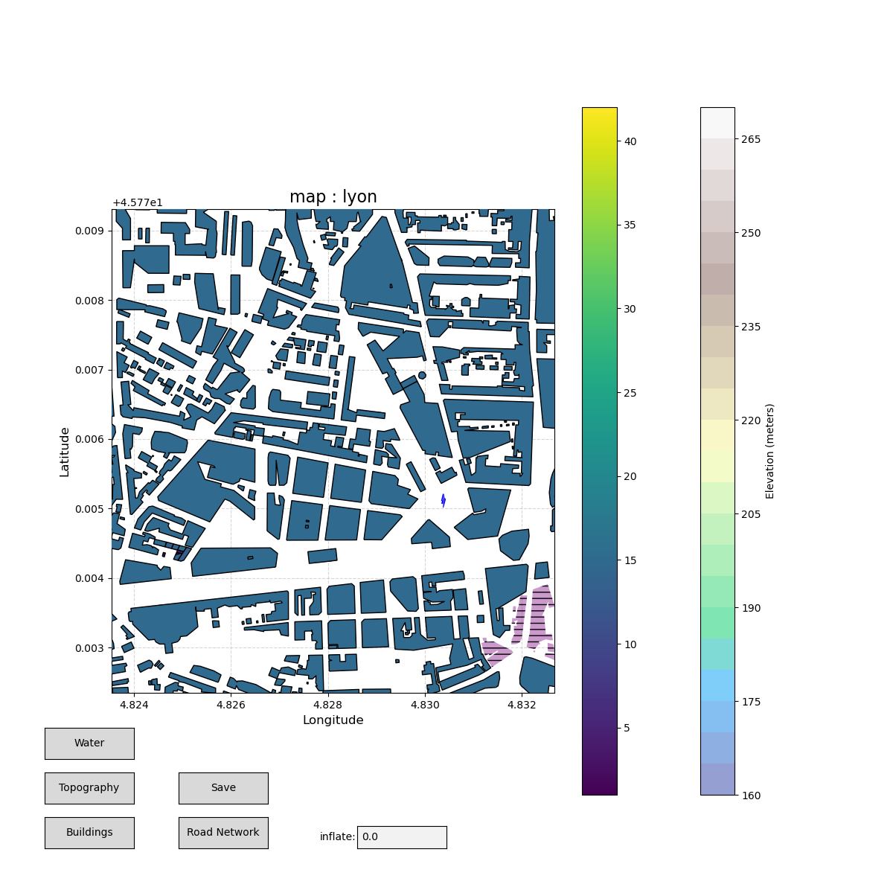
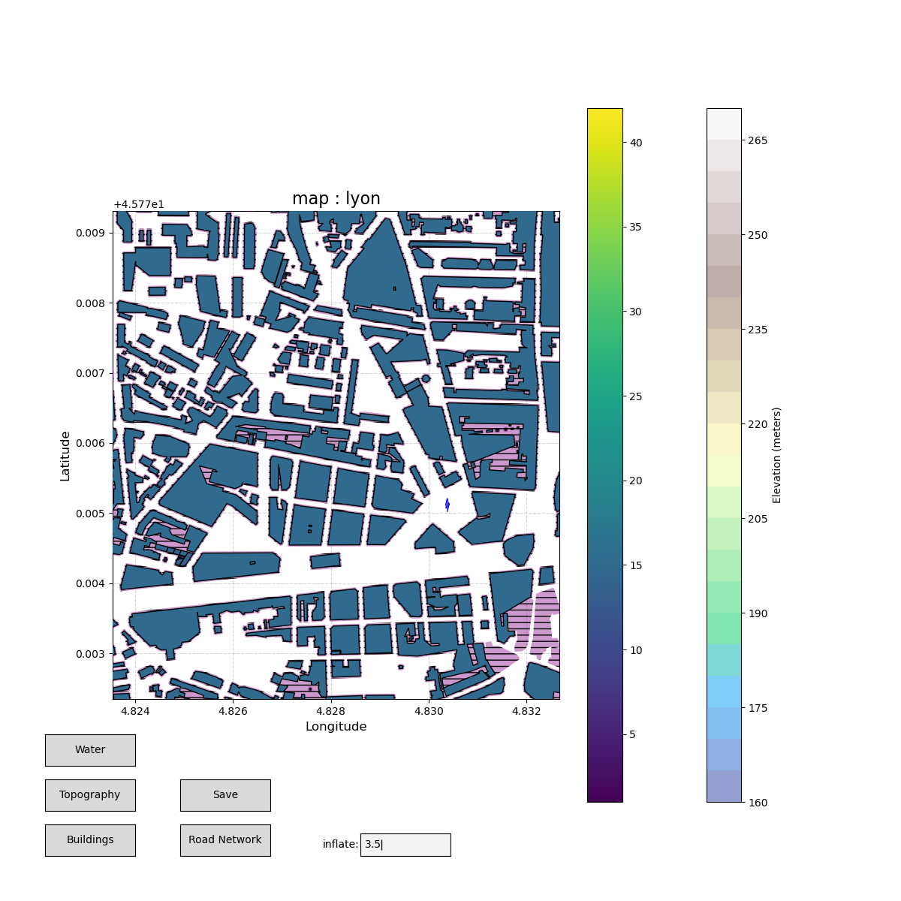
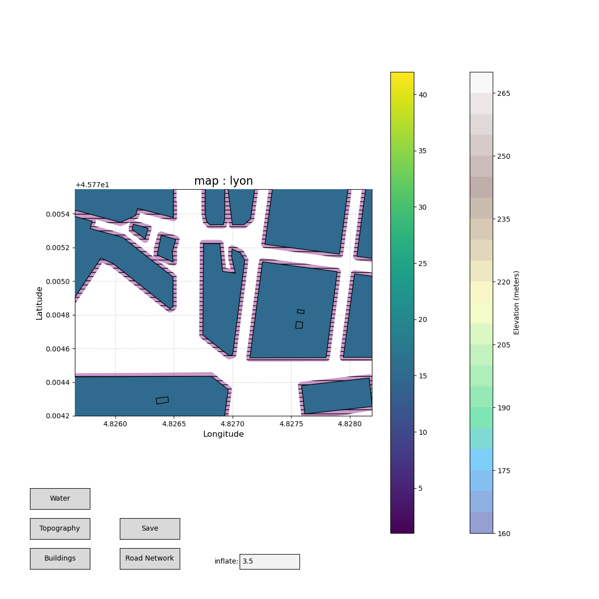

# Umap 

## Description 

Umap is a scenario builder for UAVs trafic in realistics urban environments. It aims to provide an easy and straightforward way to create those scenarios. Generated maps can be visualized, manually modified, exported as several file format (binary, JSON, parquet). Umap provides building informations (raw shape, simplified shapes, heights, type, position), inflated building, topographic informations, meaningful informations on special areas (water bodies, parks, restricted areas, etc.) and road networks. 

## Installation 

Umap relies on several libraries listed in **requierments.txt** file. 

Details on installation to write down (pip, setup, etc.). 

## Examples 

Few examples are presented below. The code documentation is provided with the code. 

```python
from Map import *
```

### Build a Umap from API requests 

Set up a region to focus on, let us see Lyon in France. 

```python 
name = "lyon"
reference_point = MapPoint(
    lon=4.832051, 
    lat=45.774792)
```

Then, initialize the Umap object using 1000 meters buffer around the reference point and considering topography data. 

```python 
umap = Map.init_from_request(
    reference_point, 
    buffer_distance=1000.0, 
    name=name, 
    topography=True) 
```

Save the map. The *save* function only saves the Umap object in a binary file. It is useful if you want to use direclty Umap objets and their functionalities. 

```python
umap.save()
```

### Load a precomputed Umap object 

Assuming the binary file to be in the /save directory. 

```python 
umap:Map = Map.load(name)
```

### Visualize with matplotlib 

```python
plot(umap) 
```

Few results of what you might expect from that. 












## Build random mission scenarios 

Explain 


## Roadmap 

### Further improvments 

Lot of ideas. 


## Notes 