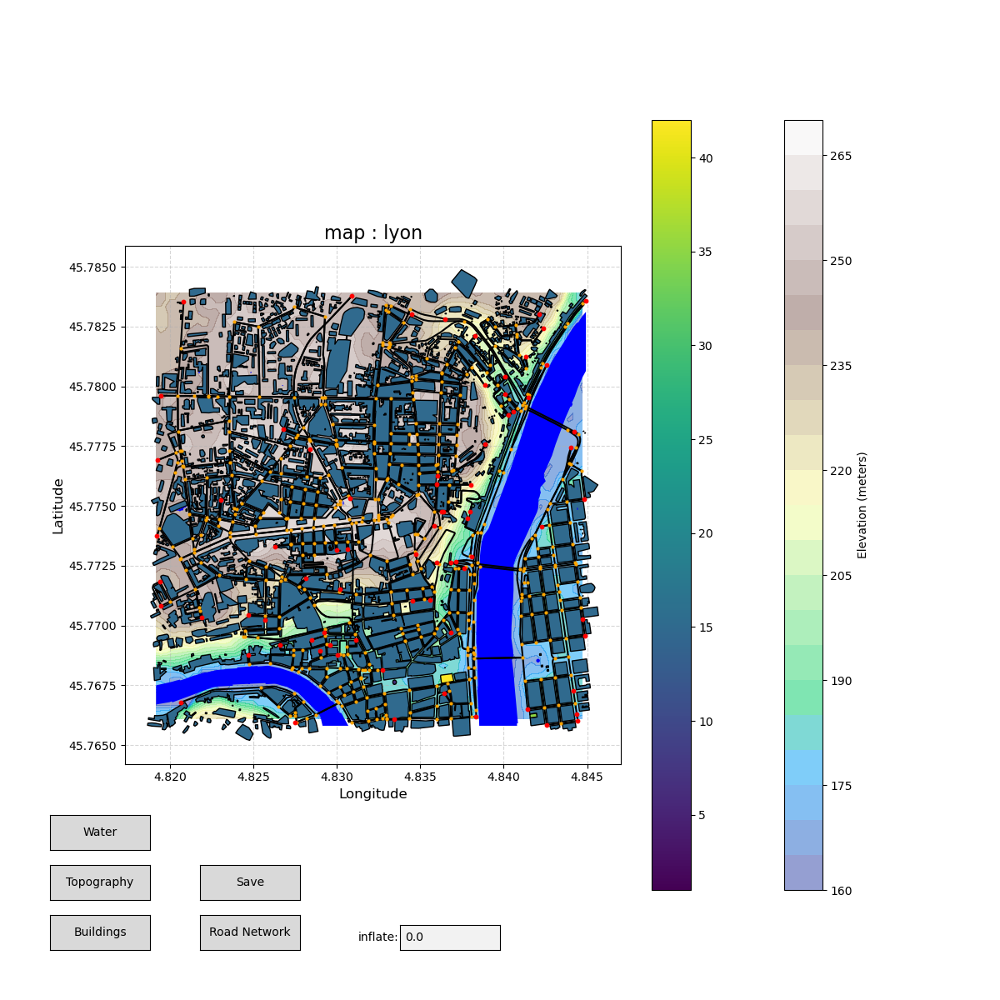
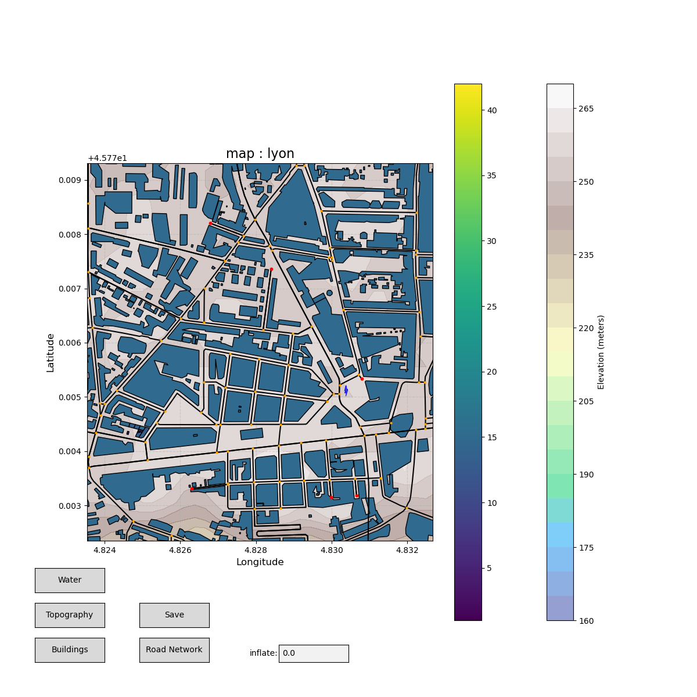
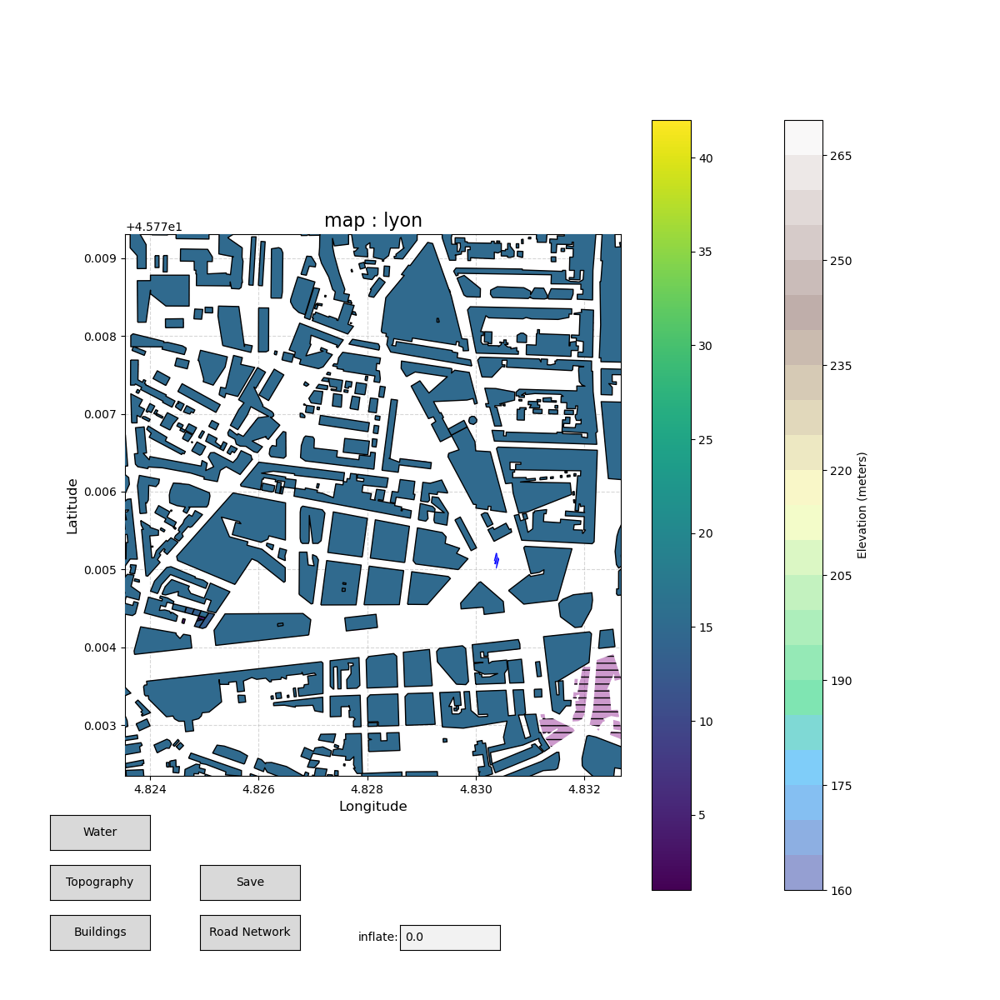
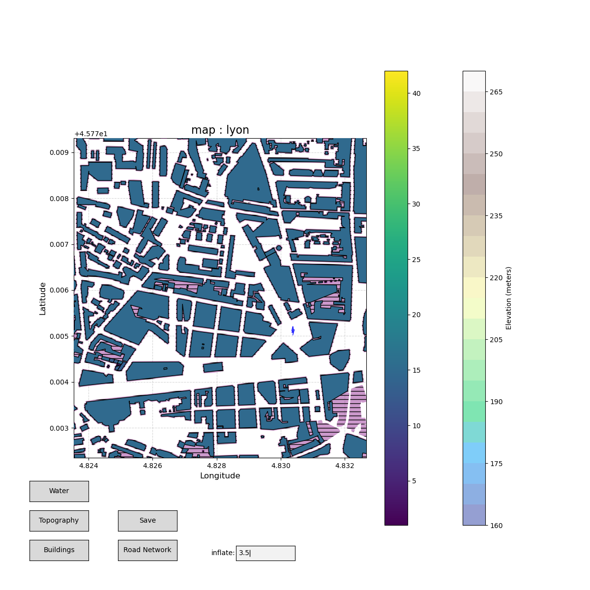
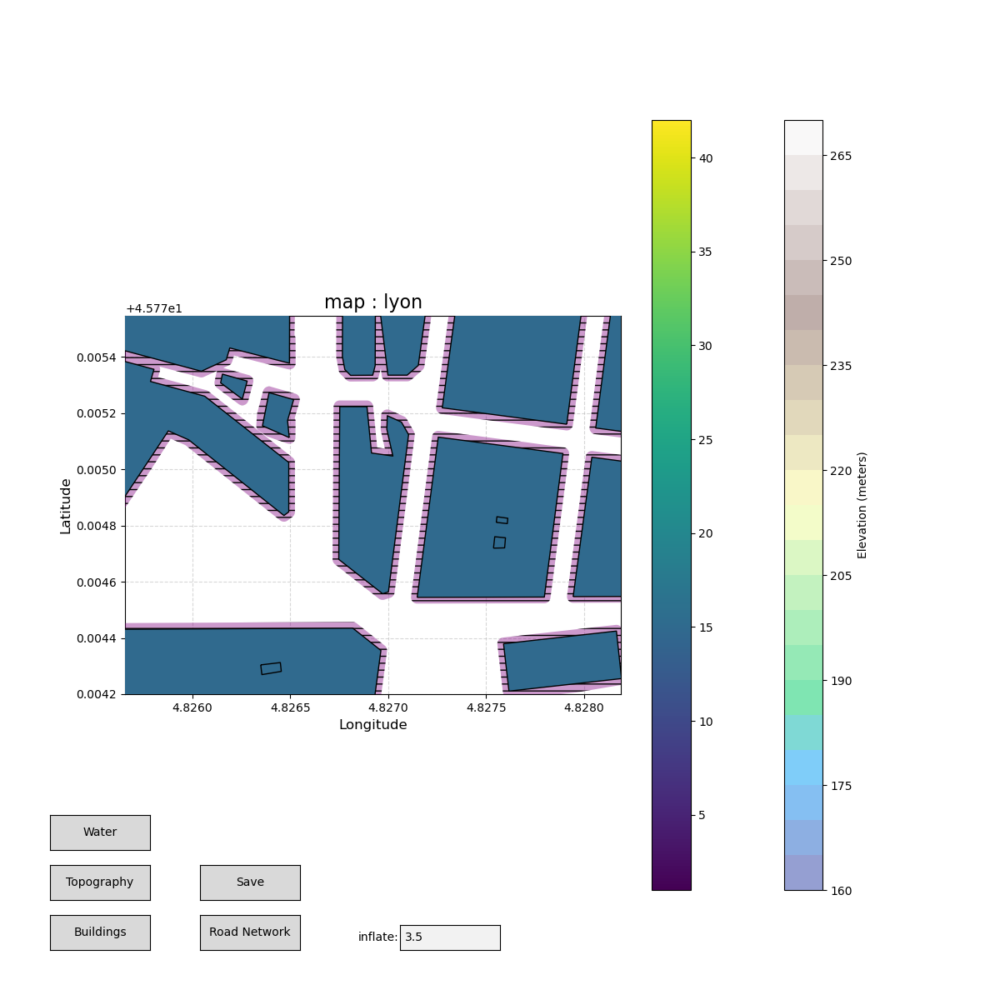

# Umap 

## Description 

Umap is a scenario builder for UAVs trafic in realistics urban environments. It aims to provide an easy and straightforward way to create those scenarios. Generated maps can be visualized, manually modified, exported as several file format (binary, JSON, parquet). Umap provides building informations (raw shape, simplified shapes, heights, type, position), inflated building, topographic informations, meaningful informations on special areas (water bodies, parks, restricted areas, etc.) and road networks. 

## Installation 

Umap relies on several libraries listed in **requierments.txt** file. 

Details on installation to write down (pip, setup, etc.). 

## Examples 

Few examples are presented below. The code documentation is provided with the code. 

```python
from Map import *
```

### Build a Umap from API requests 

Set up a region to focus on, let us see Lyon in France. 

```python 
name = "lyon"
reference_point = MapPoint(
    lon=4.832051, 
    lat=45.774792)
```

Then, initialize the Umap object using 1000 meters buffer around the reference point and considering topography data. 

```python 
umap = Map.init_from_request(
    reference_point, 
    buffer_distance=1000.0, 
    name=name, 
    topography=True) 
```

Save the map. The *save* function only saves the Umap object in a binary file. It is useful if you want to use direclty Umap objets and their functionalities. 

```python
umap.save()
```

### Load a precomputed Umap object 

Assuming the binary file to be in the /save directory. 

```python 
umap:Map = Map.load(name)
```

### Visualize with matplotlib 

```python
plot(umap) 
```

Few results of what you might expect from that. 












## Build random mission scenarios (experimental)

Umap is designed to create urban realistic scenarios but also realistic missions. A mission is defined with a start point, an end point and a departure time. For now, missions are randomly drawn from POI (Point of Interest) and Poisson distribution for departure times. 


## Roadmap 

### Already done 

ENumerate functionalities 

### Further improvments

**Simulate trajectories** : Given a set of trajectories, provide visualisation and metric compuation tools. The overall idea is to have the same scenarios and metric evaluation in order to later compare different algorithms. 

**Connect with simulation tools** : Another project named *Usim* is designed to use Umap object to find trajectories using planning, detect and avoid, optimal control and heuristic algorithms. This project will be entirely focused on the computation part, the scenario generation, visualisation and metric computations relie on Umap. What metrics are interesting ? (LoS, lengths, )

**Better missions** : We have to answer several questions. What are the different kind of missions ? (delivery, surveillance, passenger transport, industrial) And how to draw them from the map ? At the end, Umap should provide several way to create missions, with high diversity of UAVs (size, velocity, weight, autonomy, dynamics, etc.). 

**Enhance mission description** : Mission should also describe the type of UAVs with all their properties. Start with 3 different sizes. Later we can try with a lot of different existing UAVs. 

**Simplify geometry** : The building geometry should be as simple as possible in order to accelerate the simulation algorithms. A too complex environment make the computations slower. 

